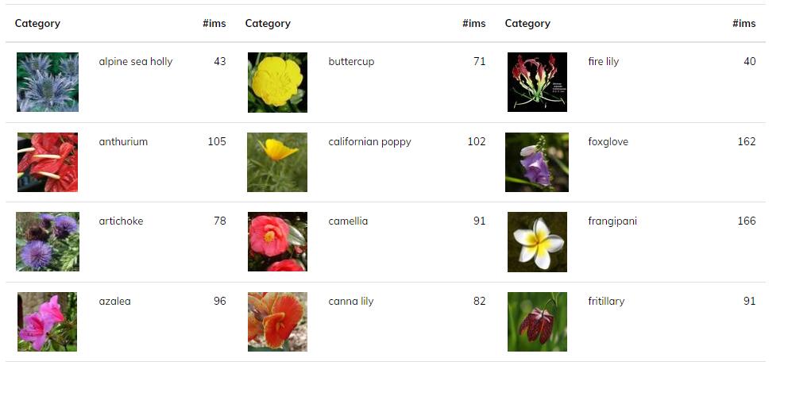

# Image-Classifier-Application-with-Pytorch
Built a neural network model on the training set of ~6.5k images of 102 flower species using 3 Torchvision pre-trained models: VGG16, VGG19 and DenseNet121, achieved accuracy of 89% on the test set of ~800 records 

The project is broken down into multiple steps:

* Load and preprocess the image dataset
* Train the image classifier on your dataset
* Use the trained classifier to predict image content

## The files in this repo:
1. Image Classifier Application Project using Pytorch.ipynb : The project file in Jupyter Notebook where most steps are conducted and validated 
2. train.py and predict.py: 2 main python functions to run the command line application. 
3. Helper functions:
    * helper.py : Host functions to process images, view images, save and load checkpoint of the model
    * TrainTestPredictFunc.py : Host functions to train, validate and predict images    

    
